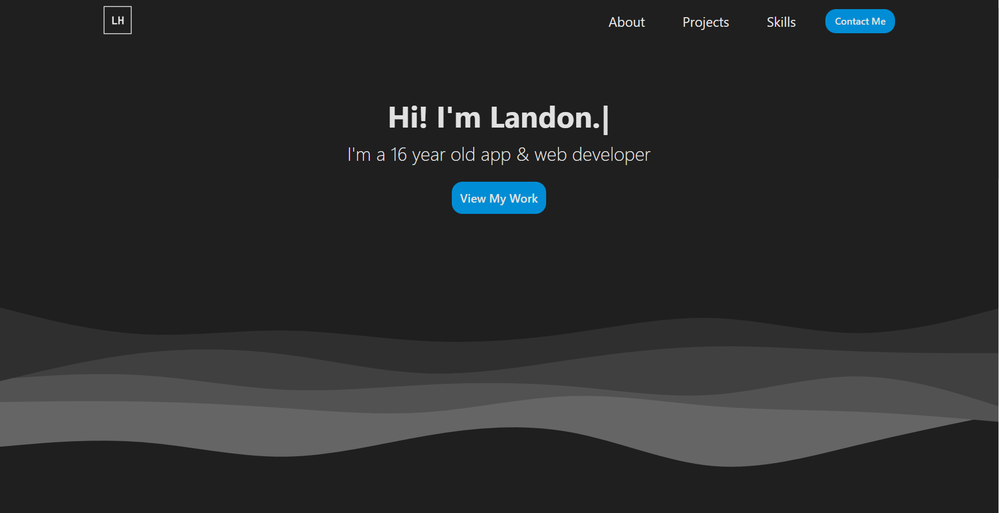

  <h1 align="center">Development Portfolio</h1>

  <h3 align="center">
   A portfolio where I can share my progress and skills as a developer
  </h3>
    <a href="https://landonharter.me" target="_blank">
Live Build
</a>
  

## About The Project:

My portfolio is a place where I can share my new projects and achievements as a developer. As I am constantly growing, I can begin to add and edit to my portfolio to show off my new skills.

### Built With:

- #### NextJS
- #### Node js

### Key concepts:

- #### React hooks
- #### State management
- #### Bare CSS
- #### Page animations